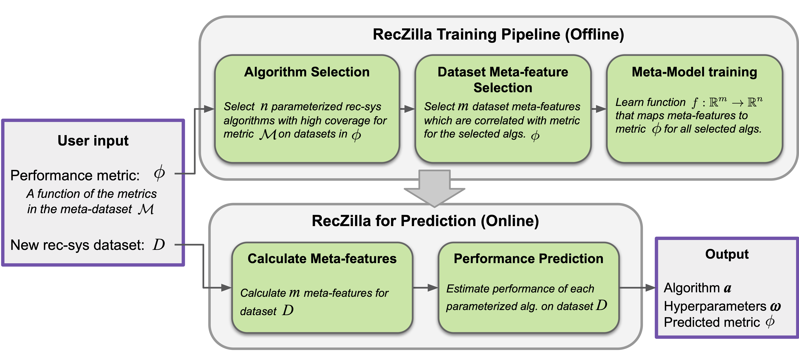

<br/>
<p align="center"></p>

----


`RecZilla` is a framework which provides the functionality to perform metalearning for algorithm selection on recommender systems datasets. It uses a meta-learner model to predict the best algorithm and hyperparameters for new, unseen datasets. 

# Overview
The figure below shows the overview of the end-to-end `RecZilla` framework pipeline.

<p align="center"></p>

This repository is based on the public repository [RecSys2019_DeepLearning_Evaluation](https://github.com/MaurizioFD/RecSys2019_DeepLearning_Evaluation). We use several core functions of this codebase---for training and evaluating algorithms, and for reading and splitting datasets. This repo extends the original `RecSys2019_DeepLearning_Evaluation` repo in several ways:
- added several datasets (classes) to the folder `Data_manager`
- removed several large dataset files from the repo
- made several small changes and bug fixes required for our experiments

**Note:** unless specified otherwise, all code should be run from the directory `reczilla/RecSys2019_DeepLearning_Evaluation/`.

# Table of contents
1. [Installation](#Installation)
2. [Datasets](#Datasets)
    1. [Loading An Implemented Dataset](#LoadingAnImplementedDataset)
    2. [Loading All Implemented Datasets](#LoadingAllImplementedDatasets)
    3. [Loading New Datasets](#LoadingNewDatasets)
3. [Evaluating Recsys Algorithms](#EvaluatingRecsysAlgorithms)
4. [Meta-Learning](#Meta-Learning)

# Installation <a name="Installation"></a>

You need Python 3.6 to use this repository.

You can start by first creating a new environment using `conda` or your preferred method.

```
# using conda
conda create -n DLevaluation python=3.6 anaconda
conda activate DLevaluation
```

Once you're done with the above step, you need to install all the dependencies in the `requirements.txt` file using,
```
pip install -r requirements.txt
```

Next step, you need to compile all the Cython algorithms. For that you will need to install `gcc` and `python3-dev`. You can install it on Linux as,
```
sudo apt install gcc 
sudo apt-get install python3-dev
```

Once installed, you can compile all the Cython algorithms by running the below command in the `RecSys2019_DeepLearning_Evaluation` directory,
```
python run_compile_all_cython.py
```
And you're all set!

# Datasets <a name="Datasets"></a>

Each recsys dataset is managed using an instance of class `DataReader` in [`DataReader.py`](RecSys2019_DeepLearning_Evaluation/Data_manager/DataReader.py). All datasets in our paper are implemented as custom subclasses of `DataReader` objects---this object handles downloading, splitting, and i/o. In the current implementation **datasets must be read using a `DataReader` object.**

Before using any recsys dataset for training, testing, or meta-learning tasks, you need to **load the dataset by calling the `load_data()` function of its `DataReader object.** This function writes a version of the dataset locally.

## Loading An Implemented Dataset <a name="LoadingAnImplementedDataset"></a>

Each dataset used in our experiment has a custom `DataReader` class; a list of these classes can be found in `Data_manager.dataset_handler.DATASET_READER_LIST`. For example, the following code downloads the `MovieLens1M` dataset to a local folder, creates a global-timestamp split, and saves the split in a different folder:

```python
from Data_manager.Movielens.Movielens100KReader import Movielens100KReader

# Folder where dataset will be loaded from. The dataset will be downloaded if it's not found here.
data_folder = "/home/datasets"

# load the dataset
data_reader = Movielens1MReader(folder=data_folder)
loaded_dataset = data_reader.load_data()
```
expected output:
```commandline
Movielens100K: reload_from_original_data is 'as-needed', will only reload original data if it cannot be found.
Movielens100K: Preloaded data not found, reading from original files...
Movielens100K: Loading original data
Movielens100K: Unable to fild data zip file. Downloading...
Downloading: http://files.grouplens.org/datasets/movielens/ml-100k.zip
In folder: /code/reczilla/RecSys2019_DeepLearning_Evaluation/Data_manager/../Data_manager_split_datasets/Movielens100K/ml-100k.zip
DataReader: Downloaded 100.00%, 4.70 MB, 922 KB/s, 5 seconds passed
Movielens100K: cleaning temporary files
Movielens100K: loading complete
Movielens100K: Verifying data consistency...
Movielens100K: Verifying data consistency... Passed!
Movielens100K: Found already existing folder '/home/datasets'
Movielens100K: Saving complete!
```

Now, the dataset `Moviekens100K` has been downloaded to folder `/home/datasets`. The following code creates a global timestamp split for this dataset:

```python
from Data_manager.DataSplitter_global_timestamp import DataSplitter_global_timestamp

# Folder where dataset splits will be written
split_folder = "/home/splits/MovieLens100K"

# split the dataset, and write it to file
data_splitter = DataSplitter_global_timestamp(data_reader)
data_splitter.load_data(save_folder_path=split_folder)
```
expected output:
```commandline
DataSplitter_global_timestamp: Cold users not allowed
DataSplitter_global_timestamp: Preloaded data not found, reading from original files...
Movielens100K: Verifying data consistency...
Movielens100K: Verifying data consistency... Passed!
split_data_on_global_timestamp: 192 cold users of total 943 users skipped
DataSplitter_global_timestamp: Split complete
DataSplitter_global_timestamp: Verifying data consistency...
DataSplitter_global_timestamp: Verifying data consistency... Passed!
DataSplitter_global_timestamp: Preloaded data not found, reading from original files... Done
DataSplitter_global_timestamp: DataReader: Movielens100K
	Num items: 1682
	Num users: 751
	Train 		interactions 79999, 	density 6.33E-02
	Validation 	interactions 1535, 	density 1.22E-03
	Test 		interactions 1418, 	density 1.12E-03
DataSplitter_global_timestamp: 
DataSplitter_global_timestamp: Done.
```

Now, the global timestamp split of `Movielens100K` has been written to `/home/splits/MovieLens100K`.

## Loading All Implemented Datasets <a name="LoadingAllImplementedDatasets"></a>
The script `Data_manager.create_all_data_splits` runs the above procedure on all datasets used in our experiments:

```commandline
usage: create_all_data_splits.py [-h] --data-dir DATA_DIR --splits-dir
                                 SPLITS_DIR

arguments:
  --data-dir DATA_DIR   Directory where the downloaded dataseta have been
                        stored. If a dataset is not downloaded, it will be
                        downloaded.
  --splits-dir SPLITS_DIR
                        Directory where the splits will be saved.
```

## Loading New Datasets <a name="LoadingNewDatasets"></a>

To load a recsys dataset that is not currently implemented, you need to create a subclass of `Data_manager.DataReader`, which specifies the loading procedure for the dataset. Once you create a `DataReader` for your dataset, you can use the same splitting and loading process from above.

If the dataset is in CSV format with columns `user_id, item_id, rating, timestamp`, then it is simple to create a class based on the example class `ExampleCSVDatasetReader`, which loads a dataset from a sample CSV included in this repository. 

This class reads a CSV from a fixed path, and loads it using shared functions:
```python
#### from Dataset_manager/ExampleCSVDataset/ExampleCSVDatasetReader.py
...

URM_path = "../examples/random_rating_list.csv"

(
    URM_all,
    URM_timestamp,
    item_original_ID_to_index,
    user_original_ID_to_index,
) = load_CSV_into_SparseBuilder(
    URM_path, separator=",", header=True, remove_duplicates=True, timestamp=True
)

loaded_URM_dict = {"URM_all": URM_all, "URM_timestamp": URM_timestamp}

loaded_dataset = Dataset(
    dataset_name=self._get_dataset_name(),
    URM_dictionary=loaded_URM_dict,
    ICM_dictionary=None,
    ICM_feature_mapper_dictionary=None,
    UCM_dictionary=None,
    UCM_feature_mapper_dictionary=None,
    user_original_ID_to_index=user_original_ID_to_index,
    item_original_ID_to_index=item_original_ID_to_index,
    is_implicit=self.IS_IMPLICIT,
)

...
```
---


# Evaluating Recsys Algorithms <a name="EvaluatingRecsysAlgorithms"></a>

The main results from our paper are based on a "meta-dataset", which consists of performance metrics for a large number of parameterized recsys algorithms on all recsys datasets implemented in this codebase.

To generate results for each algorithm-dataset pair, we use the script `Experiment_handler.run_experiment`, which takes several positional arguments: 

```
usage: run_experiment.py [-h]
                         time_limit dataset_name split_type alg_name split_dir
                         alg_seed param_seed num_samples result_dir
                         experiment_name original_split_path

positional arguments:
  time_limit           time limit in seconds
  dataset_name         name of dataset. we use this to find the dataset and
                       split.
  split_type           name of datasplitter to use. we use this to find the
                       split directory.
  alg_name             name of the algorithm to use.
  split_dir            directory containing split data files.
  alg_seed             random seed passed to the recommender algorithm. only
                       for random algorithms.
  param_seed           random seed for generating random hyperparameters.
  num_samples          number of hyperparameter samples.
  result_dir           directory where result dir structure will be written.
                       this directory should exist.
  experiment_name      name of the result directory that will be created.
  original_split_path  full path to the split data. only used for bookkeeping.
```

For example, the following call trains and evaluates 5 hyperparameter samples for algorithm `P3alphaRecommender`, using the split created in the previous section. The results of this experiment will be written to `/home/results`.

```commandline

# first, create a directory to write results in
mkdir ./example-results

python -m Experiment_handler.run_experiment \
    7200 \
    Movielens100K \
    DataSplitter_global_timestamp \
    P3alphaRecommender \
    /home/splits/MovieLens100K \
    0 \
    0 \
    5 \
    ./example-results \
    example-experiment \
    original-split-path
```

Sample output:

```commandline
[2022-06-21 12:06:57,142] [Experiment.py:__init__] : initializing Experiment: base_directory=/code/reczilla/RecSys2019_DeepLearning_Evaluation/example-results, result_directory=/code/reczilla/RecSys2019_DeepLearning_Evaluation/example-results/example-experiment, data_directory=None
[2022-06-21 12:06:57,143] [Experiment.py:__init__] : found result directory: /code/reczilla/RecSys2019_DeepLearning_Evaluation/example-results/example-experiment
[2022-06-21 12:06:57,143] [Experiment.py:prepare_dataset] : initialized dataset in Movielens100K
[2022-06-21 12:06:57,254] [Experiment.py:prepare_split] : found a split in directory /home/splits/MovieLens100K_splits
[2022-06-21 12:06:57,254] [Experiment.py:prepare_split] : initialized split Movielens100K/DataSplitter_global_timestamp
[2022-06-21 12:06:57,254] [Experiment.py:run_experiment] : WARNING: URM_validation not found in URM_dict for split Movielens100K/DataSplitter_global_timestamp
EvaluatorHoldout: Ignoring 81 (89.2%) Users that have less than 1 test interactions
EvaluatorHoldout: Ignoring 69 (90.8%) Users that have less than 1 test interactions
[2022-06-21 12:06:57,257] [Experiment.py:run_experiment] : starting experiment, writing results to example-results
[2022-06-21 12:06:57,292] [RandomSearch.py:_log_info] : RandomSearch: Starting parameter set

P3alphaRecommender: URM Detected 66 (3.92 %) cold items.
EvaluatorHoldout: Processed 81 (100.0%) in 0.34 sec. Users per second: 240
EvaluatorHoldout: Processed 69 (100.0%) in 0.32 sec. Users per second: 213
DataIO: Json dumps supports only 'str' as dictionary keys. Transforming keys to string, note that this will alter the mapper content.
[2022-06-21 12:06:58,182] [RandomSearch.py:_log_info] : RandomSearch: Starting parameter set 1 of 5

P3alphaRecommender: URM Detected 66 (3.92 %) cold items.
EvaluatorHoldout: Processed 81 (100.0%) in 0.33 sec. Users per second: 243
EvaluatorHoldout: Processed 69 (100.0%) in 0.30 sec. Users per second: 227
[2022-06-21 12:07:00,094] [RandomSearch.py:_log_info] : RandomSearch: Starting parameter set 2 of 5

P3alphaRecommender: URM Detected 66 (3.92 %) cold items.
EvaluatorHoldout: Processed 81 (100.0%) in 0.32 sec. Users per second: 250
EvaluatorHoldout: Processed 69 (100.0%) in 0.31 sec. Users per second: 221
[2022-06-21 12:07:01,058] [RandomSearch.py:_log_info] : RandomSearch: Starting parameter set 3 of 5

P3alphaRecommender: URM Detected 66 (3.92 %) cold items.
EvaluatorHoldout: Processed 81 (100.0%) in 0.38 sec. Users per second: 215
EvaluatorHoldout: Processed 69 (100.0%) in 0.31 sec. Users per second: 220
[2022-06-21 12:07:02,465] [RandomSearch.py:_log_info] : RandomSearch: Starting parameter set 4 of 5

P3alphaRecommender: URM Detected 66 (3.92 %) cold items.
EvaluatorHoldout: Processed 81 (100.0%) in 0.33 sec. Users per second: 248
EvaluatorHoldout: Processed 69 (100.0%) in 0.27 sec. Users per second: 257
[2022-06-21 12:07:04,678] [RandomSearch.py:_log_info] : RandomSearch: Search complete. Output written to: example-results/

[2022-06-21 12:07:04,684] [Experiment.py:run_experiment] : results written to file: example-results/result_20220621_120657_metadata.zip
initial result file: example-results/result_20220621_120657_metadata.zip
renaming to: example-results/result.zip
```

There are two files of interest created by this experiment script, both written to the results folder provided (`example-results`):
- a log file with namning convention `result_yyyymmdd_hhmmss_RandomSearch.txt`
- the hyperparameters and evaluation metrics, stored in a zip archive named `result.zip`


---
# Meta-Learning <a name="Meta-Learning"></a>


## Sample Usage
A sample script to perform inference on a new dataset is provided in `run_reczilla_inference.sh`. It uses pre-trained Reczilla models (located in the folder `ReczillaModels`) to select and train a recommender on a dataset specified on a path. This script can be modified to run inference on new datasets.

The script `train_reczilla_models.sh` shows samples for training metalearners for different metrics.

## Using a Trained Meta-Model for Inference

To 

## Training a New Meta-Model

The main script is `run_reczilla.py`, which must be run from RecSys2019_DeepLearning_Evaluation. It takes in these arguments:

```
> python -m ReczillaClassifier.run_reczilla -h
usage: run_reczilla.py [-h] [--train_meta] --metamodel_filepath
                       METAMODEL_FILEPATH
                       [--dataset_split_path DATASET_SPLIT_PATH]
                       [--rec_model_save_path REC_MODEL_SAVE_PATH]
                       [--metadataset_name METADATASET_NAME]
                       [--metamodel_name {xgboost,knn,linear,svm-poly}]
                       [--target_metric TARGET_METRIC]
                       [--num_algorithms NUM_ALGORITHMS]
                       [--num_metafeatures NUM_METAFEATURES]

Run Reczilla on a new dataset.

optional arguments:
  -h, --help            show this help message and exit
  --train_meta          Use to train a new metalearner Reczilla model (instead
                        of loading).
  --metamodel_filepath METAMODEL_FILEPATH
                        Filepath of Reczilla model (to save or load).
  --dataset_split_path DATASET_SPLIT_PATH
                        Path of dataset split to perform inference on. Only
                        required if performing inference
  --rec_model_save_path REC_MODEL_SAVE_PATH
                        Destination path for recommender model trained on
                        dataset on dataset_split_path.
  --metadataset_name METADATASET_NAME
                        Name of metadataset (required if training metamodel).
  --metamodel_name {xgboost,knn,linear,svm-poly}
                        Name of metalearner to use (required if training
                        metamodel).
  --target_metric TARGET_METRIC
                        Target metric to optimize.
  --num_algorithms NUM_ALGORITHMS
                        Number of algorithms to use in Reczilla (required if
                        training metamodel).
  --num_metafeatures NUM_METAFEATURES
                        Number of metafeatures to select for metalearner.
```
